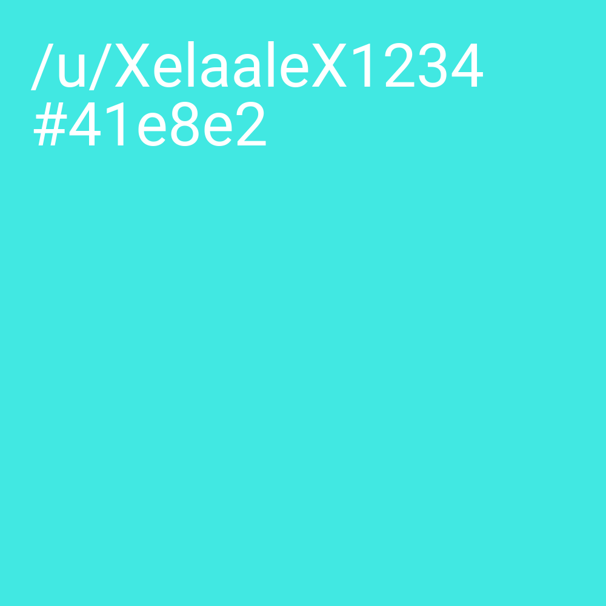
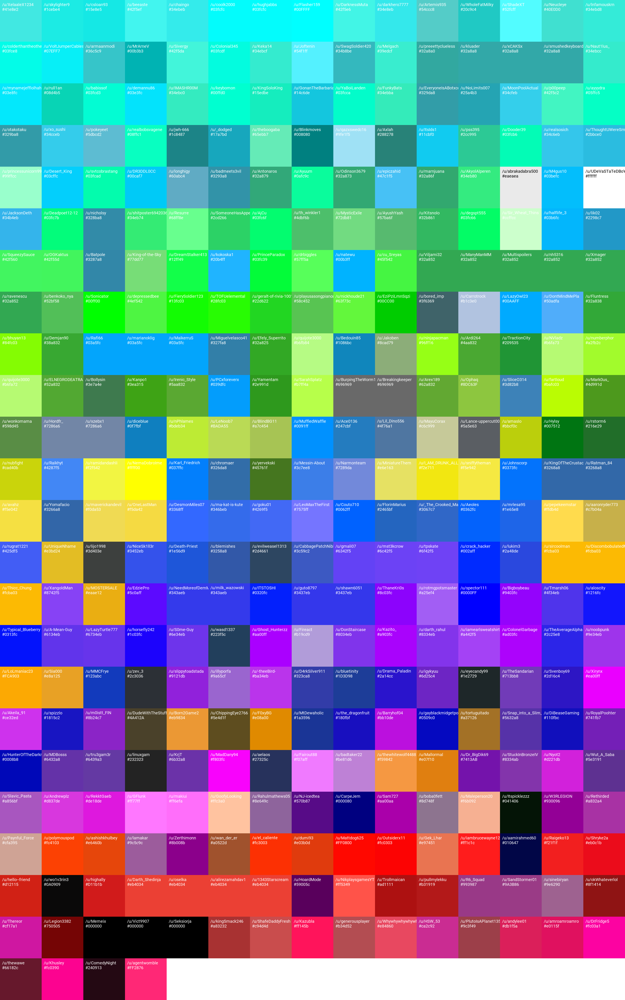

# RAOG-WinBot
Bot for the ROAG subreddit to evaluate a giveaway.

This bot scans a Reddit post's comments for HEX color codes and sorts them by how close they are to a user-determined color and generates a grid with those guesses containing information about the user that made the guess as well as the HEX color code and of course a solid field of that color. 

**The favorite color:**

**The generated grid:**

